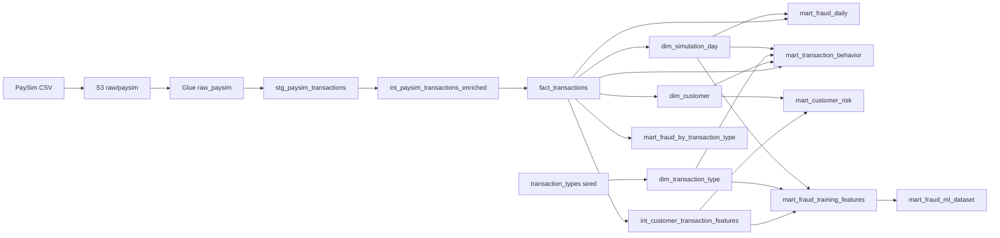

# Pipeline dbt da Financial Risk Platform

Este documento explica como o pipeline analítico deste projeto funciona, quais decisões foram tomadas e por que elas foram tomadas. Para uma introdução geral à ferramenta, consulte o [Guia geral de dbt](DBT_GUIDE.md).

## 1. Objetivo e responsabilidade do dbt

O projeto usa o conjunto de dados PaySim para construir duas famílias de produtos de dados:

- tabelas analíticas para acompanhar transações, clientes e fraude;
- uma tabela de features para treinamento e avaliação de modelos de machine learning.

O dbt começa a atuar depois da ingestão. O CSV original é enviado ao S3 e catalogado no AWS Glue pelos scripts Python. A partir da tabela externa `financial_risk_raw.raw_paysim`, o dbt executa as transformações no Amazon Athena.

Essa separação mantém responsabilidades claras:

| Etapa | Tecnologia | Responsabilidade |
|---|---|---|
| Extração e carga | Python, boto3 e S3 | Colocar o dado bruto no data lake sem alterar seu conteúdo |
| Catálogo | AWS Glue | Expor o CSV bruto como uma tabela consultável |
| Transformação | dbt Core e Athena | Limpar, enriquecer, testar e publicar produtos de dados |
| Armazenamento transformado | S3, Parquet e Glue Catalog | Persistir tabelas otimizadas para análise |

O dbt não transporta as linhas para a máquina local. Ele compila SQL com Jinja e envia esse SQL ao Athena, que lê e grava os dados no S3.

## 2. Fluxo completo dos dados



As chamadas `source()` e `ref()` formam esse grafo, ou DAG. Além de produzir o nome físico correto das relações, elas informam ao dbt a ordem das dependências.

## 3. Configuração do projeto e da conexão

O arquivo `dbt_project.yml` identifica o projeto, registra os diretórios e aplica configurações hierárquicas:

```yaml
name: financial_risk
profile: financial_risk

model-paths: ["models"]
test-paths: ["tests"]
seed-paths: ["seeds"]
macro-paths: ["macros"]

models:
  financial_risk:
    staging:
      +materialized: view
      +tags: [staging]
    intermediate:
      +materialized: view
      +tags: [intermediate]
    marts:
      +materialized: table
      +tags: [marts]
```

As configurações mais específicas dentro de um modelo podem sobrescrever essas configurações de pasta. Isso ocorre, por exemplo, em `int_customer_transaction_features`, que pertence à camada intermediária, mas é uma tabela física porque suas funções de janela são caras para recalcular a cada consulta.

O arquivo `profiles.yml` contém a conexão do adaptador `dbt-athena`:

```yaml
financial_risk:
  target: dev
  outputs:
    dev:
      type: athena
      database: awsdatacatalog
      schema: financial_risk_dev
      region_name: "{{ env_var('AWS_DEFAULT_REGION') }}"
      work_group: financial-risk-platform
      threads: 4
      s3_staging_dir: "s3://{{ env_var('BUCKET_NAME') }}/financial-risk-platform/athena-results/dbt/"
      s3_data_dir: "s3://{{ env_var('BUCKET_NAME') }}/financial-risk-platform/transformed/"
```

As credenciais e os nomes dependentes do ambiente não são gravados no repositório. O comando `uv run --env-file .env` carrega as variáveis do `.env`, e `env_var()` permite que o profile as leia.

O workgroup centraliza limites e localização de resultados do Athena. Como uma configuração forçada no workgroup pode prevalecer sobre configurações do cliente, a localização física real de uma tabela deve ser confirmada no campo `Location` do Glue/Athena. Em execuções deste projeto, tabelas também podem aparecer sob `athena-results/tables/<uuid>` em vez do prefixo lógico `transformed/`. Resultado de consulta e dado de tabela são conceitos diferentes, mesmo quando estão no mesmo bucket.

## 4. Camadas e granularidade

Cada modelo deve ter uma granularidade explícita: o que uma linha representa. Essa definição orienta chaves, testes e agregações.

| Modelo | Granularidade | Materialização | Função |
|---|---|---|---|
| `stg_paysim_transactions` | Uma transação bruta | View | Renomear, limpar e converter tipos |
| `int_paysim_transactions_enriched` | Uma transação | View | Criar tempo, tipo de conta e deltas de saldo |
| `fact_transactions` | Uma transação | Incremental/Parquet | Fato central e identificador determinístico |
| `int_customer_transaction_features` | Uma transação de origem | Table/Parquet | Histórico e comportamento anterior do cliente |
| `dim_customer` | Um cliente | Table/Parquet | Histórico de aparição e papel do cliente |
| `dim_transaction_type` | Um tipo de transação | Table/Parquet | Metadados mantidos em seed |
| `dim_simulation_day` | Um dia simulado | Table/Parquet | Calendário da simulação |
| `mart_fraud_by_transaction_type` | Um tipo de transação | Table/Parquet | Indicadores de fraude por tipo |
| `mart_fraud_daily` | Um dia simulado | Table/Parquet | Série diária, acumulados e janela móvel |
| `mart_customer_risk` | Um cliente com pelo menos 2 transações | Table/Parquet | Sinais e classificação heurística de risco |
| `mart_transaction_behavior` | Dia, tipo e papel do cliente | Table/Parquet | Visão multidimensional para dashboard |
| `mart_fraud_training_features` | Uma transação | Table/Parquet | Features utilizáveis no instante da transação |
| `mart_fraud_ml_dataset` | Uma transação | View | Divisão temporal em treino, validação e teste |

### Por que staging, intermediate e marts?

- `staging` cria um contrato limpo com o dado externo. Regras de negócio não devem ser espalhadas aqui.
- `intermediate` concentra transformações reutilizáveis ou complexas que ainda não são produtos finais.
- `marts` publica relações com granularidade e finalidade definidas para análise, dashboard ou ML.

Essa organização evita que cada consumidor tenha que reinterpretar colunas brutas como `nameorig`, `oldbalanceorg` ou `isfraud`.

## 5. Source e staging

A tabela criada pelo Glue é declarada em `models/staging/sources.yml`:

```yaml
sources:
  - name: paysim_raw
    database: awsdatacatalog
    schema: financial_risk_raw
    tables:
      - name: raw_paysim
```

O staging usa a referência lógica:

```sql
select *
from {{ source('paysim_raw', 'raw_paysim') }}
```

O dbt compila isso para o nome físico completo no catálogo. O uso de `source()` é preferível a escrever o nome físico diretamente porque cria linhagem, permite documentação/testes da origem e separa o código do local físico.

Em seguida, o modelo padroniza nomes e tipos:

```sql
cast(step as bigint) as simulation_step,
upper(trim(type)) as transaction_type,
cast(amount as decimal(18, 2)) as transaction_amount,
trim(nameorig) as origin_account_id,
isfraud = 1 as is_fraud
```

Decisões importantes:

- valores monetários usam `decimal(18, 2)` para evitar imprecisão binária nas somas financeiras;
- texto é limpo com `trim` e categorias são normalizadas com `upper`;
- indicadores `0/1` viram booleanos para simplificar filtros e regras posteriores;
- nomes técnicos passam para `snake_case` legível.

## 6. Enriquecimento intermediário

`int_paysim_transactions_enriched` interpreta cada `step` como uma hora da simulação:

```sql
cast(floor((simulation_step - 1) / 24.0) + 1 as integer)
    as simulation_day,
cast(mod(simulation_step - 1, 24) as integer)
    as simulation_hour
```

Subtrair 1 antes da divisão faz com que os steps `1` a `24` pertençam ao dia 1 e que as horas fiquem no intervalo `0` a `23`.

O prefixo da conta de destino é usado para criar uma categoria reutilizável:

```sql
case
    when destination_account_id like 'M%' then 'MERCHANT'
    when destination_account_id like 'C%' then 'CUSTOMER'
    else 'UNKNOWN'
end as destination_account_type
```

Os deltas de saldo também são calculados uma única vez:

```sql
origin_balance_after - origin_balance_before as origin_balance_delta,
destination_balance_after - destination_balance_before
    as destination_balance_delta
```

## 7. Fato transacional e carga incremental

`fact_transactions` é o centro do modelo dimensional. Ele persiste os dados em Parquet com compressão Snappy e particiona por dia:

```sql
{{
    config(
        materialized='incremental',
        incremental_strategy='insert_overwrite',
        table_type='hive',
        format='parquet',
        write_compression='SNAPPY',
        partitioned_by=['simulation_day'],
        on_schema_change='sync_all_columns'
    )
}}
```

Motivações:

- Parquet é colunar e permite que o Athena leia apenas as colunas necessárias;
- Snappy reduz armazenamento e leitura com descompressão rápida;
- o particionamento permite poda quando a consulta filtra `simulation_day`;
- `insert_overwrite` substitui as partições processadas, evitando duplicar suas linhas;
- `sync_all_columns` trata mudanças compatíveis de esquema, embora mudanças devam continuar sendo revisadas.

Na primeira execução, `is_incremental()` é falso e todas as linhas são criadas. Nas execuções seguintes, apenas a última partição conhecida e partições posteriores são selecionadas:

```sql

    where simulation_day >= (
        select coalesce(max(simulation_day), 1)
        from {{ this }}
    )

```

Reprocessar a última partição permite absorver registros atrasados daquele dia. A decisão assume uma fonte predominantemente append-only e não detecta alterações em dias mais antigos. Se o histórico bruto for corrigido, deve-se ampliar a janela incremental ou executar:

```bash
uv run --env-file .env dbt run \
  --profiles-dir . \
  --full-refresh \
  --select fact_transactions+
```

O identificador da transação é um hash dos atributos originais:

```sql
to_hex(
    md5(
        to_utf8(
            concat_ws('|', ...)
        )
    )
) as transaction_id
```

Isso torna a chave reproduzível sem depender da ordem física do CSV. Duas linhas totalmente idênticas receberiam a mesma chave; o teste `unique` existe justamente para detectar essa situação.

## 8. Dimensões e seed

### `dim_customer`

Combina aparições como origem e como destino usando `union all`, calcula primeira e última aparição com funções de janela e mantém uma linha por cliente usando `row_number()`.

`union all` foi escolhido porque os eventos devem ser preservados; `union` eliminaria duplicatas e adicionaria um custo de deduplicação que mudaria as contagens.

### `dim_transaction_type`

É construída a partir de `seeds/transaction_types.csv`:

```sql
select
    transaction_type,
    transaction_family,
    balance_direction,
    description
from {{ ref('transaction_types') }}
```

Um seed é apropriado porque existem apenas cinco códigos estáveis e controlados pelo projeto. Ele torna a classificação versionável e evita repetir `case` em vários modelos.

### `dim_simulation_day`

Deriva semana, dia da semana simulada, primeiro/último step e completude do dia. Não é um calendário civil: o PaySim fornece tempo simulado, não uma data real.

## 9. Features comportamentais e prevenção de vazamento

`int_customer_transaction_features` utiliza funções de janela por conta de origem. A ordenação é determinística:

```sql
partition by origin_account_id
order by simulation_step, transaction_id
```

O `transaction_id` desempata transações ocorridas no mesmo step. Entre as features estão:

- posição da transação no histórico do cliente;
- valor e step da transação anterior;
- quantidade, média e desvio padrão das 10 transações anteriores;
- histórico acumulado anterior;
- frequência nas últimas 24 horas e 7 dias;
- razão e z-score do valor atual contra o comportamento anterior.

As janelas usadas por features de treinamento terminam em `1 preceding`:

```sql
avg(cast(transaction_amount as double)) over (
    partition by origin_account_id
    order by simulation_step, transaction_id
    rows between 10 preceding and 1 preceding
) as avg_last_10_transactions
```

Isso é uma decisão central: a linha atual não entra em seu próprio histórico e informações futuras não são usadas para prever o passado.

O modelo intermediário calcula `next_transaction_amount` para fins analíticos e educacionais, mas `mart_fraud_training_features` não seleciona essa coluna. Também não usa saldos posteriores nem deltas posteriores como features. Esses campos são conhecidos após a transação e poderiam causar vazamento de alvo ou de tempo.

## 10. Marts analíticos

### Fraude por tipo de transação

`mart_fraud_by_transaction_type` mede volume, valor, fraude, detecção e fraude não detectada para cada tipo. Divisões reutilizam macros:

```sql
{{ fraud_rate(
    'fraudulent_transaction_count',
    'transaction_count'
) }}
```

`fraud_rate` chama `safe_divide`, que usa `nullif(denominator, 0.0)`. O resultado é `null` quando a taxa não é matematicamente definida, em vez de provocar divisão por zero.

### Fraude diária

`mart_fraud_daily` usa `lag` para comparar com o dia anterior e janelas para calcular métricas móveis e acumuladas:

```sql
sum(fraudulent_transaction_count) over (
    order by simulation_day
    rows between 6 preceding and current row
) as rolling_7d_fraud_count
```

O frame contém o dia atual e os seis anteriores: até sete dias observados.

### Risco por cliente

`mart_customer_risk` agrega comportamento por cliente e aplica uma heurística transparente:

- `HIGH`: possui fraude conhecida;
- `MEDIUM`: não possui fraude conhecida, mas apresenta anomalia de alto valor;
- `LOW`: não atende às condições anteriores.

Essa classificação não é um modelo preditivo. É uma regra interpretável para análise e priorização.

### Comportamento transacional

`mart_transaction_behavior` combina fato e dimensões e agrega por dia, tipo e papel do cliente. É voltado a dashboards, pois já entrega métricas na granularidade de consumo.

## 11. Dataset de machine learning

`mart_fraud_training_features` seleciona apenas informações que podem ser conhecidas no instante da decisão, acrescenta indicadores categóricos e mantém `is_fraud` como alvo.

O campo `baseline_rule_flag` preserva `is_flagged_fraud`. Ele permite comparar um futuro modelo com a regra original do PaySim, sem tratá-la como se fosse o alvo.

`mart_fraud_ml_dataset` é uma view que aplica uma divisão cronológica:

```yaml
vars:
  ml_train_end_step: 322
  ml_validation_end_step: 375
```

```sql
case
    when simulation_step <= {{ var('ml_train_end_step') }} then 'TRAIN'
    when simulation_step <= {{ var('ml_validation_end_step') }} then 'VALIDATION'
    else 'TEST'
end as dataset_split
```

A divisão temporal foi escolhida em vez de amostragem aleatória porque fraude é um problema temporal. Treinar com eventos futuros e avaliar em eventos passados daria uma estimativa otimista. Os cortes aproximam uma divisão 70/15/15 por volume, mas o período de teste apresenta maior taxa de fraude; isso é um caso realista de mudança de distribuição e deve ser discutido na avaliação do modelo.

A view evita copiar novamente mais de seis milhões de linhas: ela apenas adiciona a coluna de split sobre a tabela de features já materializada.

## 12. Estratégia de testes

O projeto combina testes genéricos declarados em YAML e testes singulares escritos em SQL.

### Testes genéricos

Exemplo de contrato de uma chave:

```yaml
columns:
  - name: transaction_id
    data_tests:
      - not_null
      - unique
      - relationships:
          arguments:
            to: ref('fact_transactions')
            field: transaction_id
```

- `not_null` verifica preenchimento;
- `unique` verifica unicidade;
- `accepted_values` limita domínios categóricos;
- `relationships` verifica integridade referencial.

### Testes singulares

Um teste singular é uma consulta que retorna as linhas inválidas. Zero linhas significa aprovação. Por exemplo:

```sql
select *
from {{ ref('stg_paysim_transactions') }}
where transaction_amount < 0
   or origin_balance_before < 0
   or destination_balance_before < 0
```

Os testes deste projeto também verificam invariantes entre modelos:

- staging, fato e features preservam a quantidade de transações;
- marts agregados preservam contagens e valores totais;
- sequências de clientes são consistentes;
- janelas históricas não contêm a linha atual;
- métricas de fraude respeitam limites lógicos;
- cada split temporal contém as classes legítima e fraude.

Esses testes são mais fortes que apenas verificar nulos: eles validam a semântica do pipeline.

## 13. Macros

`safe_divide` encapsula uma operação recorrente:

```sql

    (
        cast({{ multiplier }} as double)
        * cast({{ numerator }} as double)
        / nullif(cast({{ denominator }} as double), 0.0)
    )

```

`fraud_rate` especializa a macro com multiplicador `100.0`. A motivação é manter a definição da taxa consistente e corrigir a regra em um único lugar. Macros geram SQL durante a compilação; elas não são funções executadas linha a linha pelo Python.

Sempre confira o SQL produzido após mudar uma macro:

```bash
uv run --env-file .env dbt compile \
  --profiles-dir . \
  --select mart_fraud_by_transaction_type
```

## 14. Tags e seletores operacionais

As tags agrupam recursos por finalidade, enquanto `selectors.yml` registra seleções reutilizáveis.

| Seletor | Conteúdo |
|---|---|
| `ml_pipeline` | Modelos com tag `ml` e seus ancestrais |
| `daily_pipeline` | Mart diário e seus ancestrais |
| `dashboard_marts` | Marts voltados ao dashboard |
| `dimensions` | Dimensões analíticas |

Antes de executar, é possível inspecionar a seleção sem consultar dados:

```bash
uv run --env-file .env dbt ls \
  --profiles-dir . \
  --selector ml_pipeline
```

Para construir o pipeline selecionado na ordem do DAG e executar seus testes:

```bash
uv run --env-file .env dbt build \
  --profiles-dir . \
  --selector ml_pipeline
```

## 15. Sequência recomendada de operação

Depois que a ingestão e o Glue Crawler terminarem:

```bash
# 1. Verificar conexão e configuração.
uv run --env-file .env dbt debug --profiles-dir .

# 2. Carregar tabelas pequenas versionadas em CSV.
uv run --env-file .env dbt seed --profiles-dir .

# 3. Conferir quais nós serão selecionados.
uv run --env-file .env dbt ls --profiles-dir . --selector ml_pipeline

# 4. Construir modelos e testar na ordem das dependências.
uv run --env-file .env dbt build --profiles-dir .

# 5. Gerar o catálogo e a linhagem navegável.
uv run --env-file .env dbt docs generate --profiles-dir .
uv run --env-file .env dbt docs serve --profiles-dir .
```

Durante o desenvolvimento, prefira seleções pequenas para economizar leitura no Athena:

```bash
uv run --env-file .env dbt build \
  --profiles-dir . \
  --select mart_fraud_daily
```

Use `+modelo` para incluir ancestrais, `modelo+` para incluir descendentes e `+modelo+` para ambos.

## 16. Decisões, benefícios e limitações

| Decisão | Benefício | Limitação ou cuidado |
|---|---|---|
| Views em staging | Evita cópias e mantém a transformação simples | Cada consumo relê o CSV bruto |
| Tabelas Parquet nos cálculos caros | Reduz leitura e tempo no Athena | Ocupa armazenamento e precisa ser reconstruída |
| Partição por dia | Poda consultas temporais | Muitas partições pequenas seriam prejudiciais; aqui existem poucos dias |
| Fato incremental com `insert_overwrite` | Atualiza apenas partições recentes sem duplicar | Correções históricas exigem janela maior ou `--full-refresh` |
| Chave MD5 determinística | Reprodutibilidade sem ID fornecido pela fonte | Linhas integralmente idênticas colidem por definição |
| Seed para tipos | Regra pequena, legível e versionada | Não serve para dimensões grandes ou atualizadas frequentemente |
| Split temporal | Avaliação mais realista e sem futuro no treino | Distribuição das classes varia entre períodos |
| Macros de taxa | Uma única definição e divisão segura | Erros na macro afetam todos os consumidores; compile e teste |
| Testes de invariantes | Detectam perda silenciosa e erro de regra | Consultas que varrem milhões de linhas têm custo no Athena |

## 17. Estrutura relevante do repositório

```text
dbt_project.yml
profiles.yml
selectors.yml
models/
├── staging/
├── intermediate/
└── marts/
macros/
seeds/
tests/
target/          # artefatos gerados; não é código-fonte
logs/            # logs de execução
```

## 18. Referências oficiais

- [Modelos dbt](https://docs.getdbt.com/docs/build/models)
- [Sources](https://docs.getdbt.com/docs/build/sources)
- [Função `ref`](https://docs.getdbt.com/reference/dbt-jinja-functions/ref)
- [Data tests](https://docs.getdbt.com/docs/build/data-tests)
- [Modelos incrementais](https://docs.getdbt.com/docs/build/incremental-models)
- [Seletores YAML](https://docs.getdbt.com/reference/node-selection/yaml-selectors)
- [Comando `dbt build`](https://docs.getdbt.com/reference/commands/build)
- [Comandos de documentação](https://docs.getdbt.com/reference/commands/cmd-docs)

